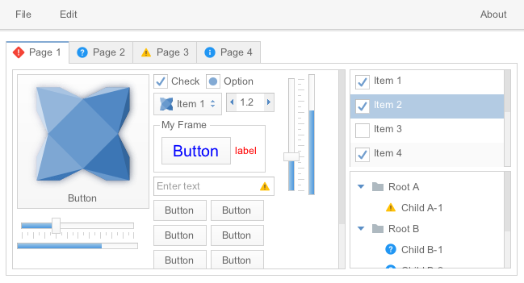

haxeui-kha
================================

haxeui-kha is the Kha backend for HaxeUI.



## Installation
haxeui-kha has a dependency to haxeui-core, and so that too must be installed. Once haxeui-core is installed, haxeui-kha can be installed using:

```
haxelib install haxeui-kha
```

### Kha
haxeui-kha also has a dependancy on Kha, this can be installed in an empty directory via git using the following commands:

```
git init
git submodule add https://github.com/KTXSoftware/Kha
git submodule update --init --recursive
```

_Note: HaxeUI comes with a set of command line tools that can also perform this step for you using:
haxelib run haxeui-core install kha_

## Usage
The simplest method to create a new Kha application that is HaxeUI ready is to use the HaxeUI command line tools. These tools will allow you to start a new project rapidly with HaxeUI support baked in. To create a new skeleton application using haxeui-kha run the following command in the folder where Kha has been installed:

```
haxelib run haxeui-core create kha
```

### khamake.js
Simply add the following lines to your khamake.js and rebuild your project files.

```js
project.addLibrary('haxeui-core');
project.addLibrary('haxeui-kha');
```

## Toolkit initialisation and usage
The Kha system itself must be initialised and a render loop started. This can be done by using code similar to:

```haxe
class Main {
    public static function main() {
        kha.System.start({}, function ( _ ) {
            kha.Assets.loadEverything(function() {
                haxe.ui.Toolkit.init();

                final screen = haxe.ui.core.Screen.instance;
                final ui = haxe.ui.macros.ComponentMacros.buildComponent("ui.xml");

                screen.addComponent(ui);

                kha.System.notifyOnFrames(function( framebuffers: Array ) {
                    final fb = framebuffers[0];
                    final g2 = fb.g2;
                    g2.begin(true, kha.Color.White);
                        screen.renderTo(g2);
                    g2.end();
                });
            });
        });
    }
}
```

## HTML5 specifics
As well as using the generic `Screen.instance.addComponent`, it is also possible to render a component to a specific surface use the components special `renderTo` function. Eg:

```haxe
main.renderTo(...);
```