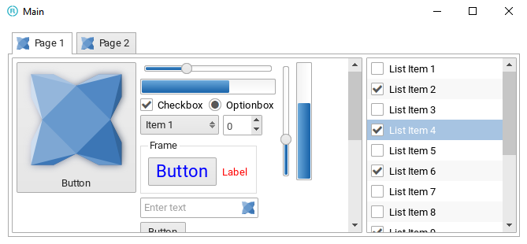

haxeui-openfl
================================

haxeui-openfl is the OpenFL backend for HaxeUI.



## Installation
haxeui-openfl has a dependency to haxeui-core, and so that too must be installed. Once haxeui-core is installed, haxeui-openfl can be installed using:

```
haxelib install haxeui-openfl
```

### OpenFL
haxeui-openfl also has a dependancy on OpenFL, this can be installed via haxelib using the following commands:

```
haxelib install openfl
haxelib run openfl setup
```

## Usage
The simplest method to create a new OpenFL application that is HaxeUI ready is to use the HaxeUI command line tools. These tools will allow you to start a new project rapidly with HaxeUI support baked in. To create a new skeleton application using haxeui-openfl create a new folder and use the following command:

```
haxelib run haxeui-core create openfl
```

If however you already have an existing application, then incorporating HaxeUI into that application is straightforward:

### project.xml / application.xml
Simply add the following lines to your `project.xml` or your `application.xml`.

```xml
<haxelib name="haxeui-core" />
<haxelib name="haxeui-openfl" />
```

## Toolkit initialisation and usage
Initialising the toolkit requires you to add this single line somewhere before you start to actually use HaxeUI in your application:

```haxe
Toolkit.init();
```

## OpenFL specifics
As well as using the generic `Screen.instance.addComponent`, since HaxeUI components in haxeui-openfl extend from `openfl.display.Sprite` it is also possible to add components directly to any other OpenFL sprite (eg: `Lib.current.stage.addChild`).