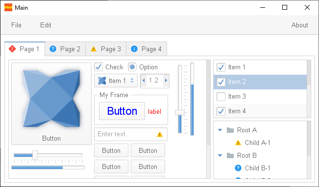

haxeui-nme
================================

haxeui-nme is the NME backend for HaxeUI.



## Installation

haxeui-nme has a dependency to haxeui-core, and so that too must be installed. Once haxeui-core is installed, haxeui-nme can be installed using:

```
haxelib install haxeui-nme
```

### NME
haxeui-nme also has a dependency on NME, this can be installed via haxelib using the following commands:

```
haxelib install nme
haxelib run nme setup
```

## Usage
The simplest method to create a new NME application that is HaxeUI ready is to use the HaxeUI command line tools. These tools will allow you to start a new project rapidly with HaxeUI support baked in. To create a new skeleton application using haxeui-nme run the following command in the folder where Kha has been installed:

```
haxelib run haxeui-core create nme
```

If however you already have an existing application, then incorporating HaxeUI into that application is straightforward:

### project.nmml

Simply add the following lines to your `project.nmml`.

```xml
<haxelib name="haxeui-core" />
<haxelib name="haxeui-nme" />
```

## Toolkit initialisation and usage
Initialising the toolkit requires you to add this single line somewhere before you start to actually use HaxeUI in your application:

```haxe
Toolkit.init();
```

## NME specifics
As well as using the generic `Screen.instance.addComponent`, since HaxeUI components in haxeui-nme extend from `nme.display.Sprite` it is also possible to add components directly to any other NME sprite (eg: `Lib.current.stage.addChild`).