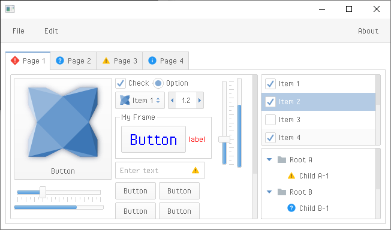

haxeui-heaps
================================

haxeui-heaps is the Heaps backend for HaxeUI.



## Installation
haxeui-heaps has a dependency to haxeui-core, and so that too must be installed. Once haxeui-core is installed, haxeui-heaps can be installed using:

```
haxelib install haxeui-heaps
```

### Heaps
haxeui-heaps also has a dependency on Heaps, this can be installed via haxelib using the following command:

```
haxelib install heaps
```

_Important: If you want to use heaps in a desktop applicaiton (ie, via HashLink) then you also need install the SDL libraries for heaps using the following command: haxelib run install hsdl_

## Usage
The simplest method to create a new native application that is HaxeUI ready is to use the HaxeUI command line tools. These tools will allow you to start a new project rapidly with HaxeUI support baked in. To create a new skeleton application using haxeui-heaps create a new folder and use the following command:

```
haxelib run haxeui-core create heaps
```

If however you already have an existing application, then incorporating HaxeUI into that application is straightforward:

### Haxe build.hxml

If you are using a command line build (via a .hxml file) then add these lines:

```
-lib heaps
-lib haxeui-core
-lib haxeui-heaps
```

_Important: If you are using heaps in a desktop applicaiton (ie, via HashLink) then you also need include the SDL library into your application with the following: -lib hsdl_

## Toolkit initialisation and usage
Initialising the toolkit requires you to add this single line somewhere before you start to actually use HaxeUI in your application:

```haxe
Toolkit.init();
```

## Heaps specifics
As well as using the generic `Screen.instance.addComponent`, since HaxeUI components in haxeui-heaps extend from `h2d.Object` it is also possible to add components directly to any other Heaps s2d object (eg: `hxd.App.s2d`).