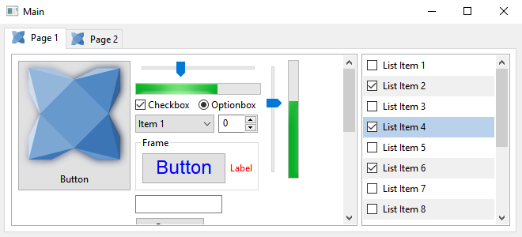
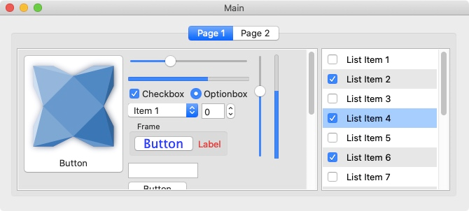
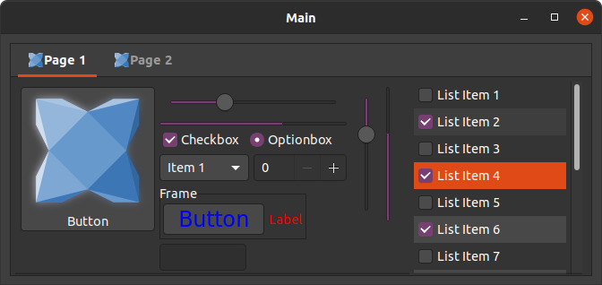

haxeui-hxwidgets
================================
haxeui-hxwidgets is the wxWidgets backend for HaxeUI. It produces a GUI that is built from native components via the wxWidgets framework







## Installation
haxeui-hxwidgets has a number of dependencies since it produces native components via the wxWidgets library.

### wxWidgets
wxWidgets is a C++ library that lets developers create applications for Windows, macOS, Linux and other platforms with a single code base. This is the library that haxeui-hxwidgets uses to create native components (via its haxe externs hxWidgets).

### wxWidgets - Windows
* Download and install wxWidgets using installer from https://www.wxwidgets.org/downloads/
* Create `WXWIN` environment var if setup didnt (eg: `C:\wxWidgets-3.0.2`)
* Run `vcvarsall.bat` from Visual Studio dir (eg: `"C:\Program Files (x86)\Microsoft Visual Studio 14.0\VC\vcvarsall.bat"`)
* Build shared and static releases of wxWidgets:
  * `cd %WXWIN%\build\msw\`
  * `nmake.exe -f makefile.vc BUILD=release`
  * `nmake.exe -f makefile.vc BUILD=release SHARED=1`

### wxWidgets - OSX
You need at least OSX 10.7 and you can install wxWidgets with:

```
brew update
brew install wxwidgets
```

### wxWidgets - Linux
wxWidgets can be installed on debian/ubuntu with:

debian/ubuntu 20.04 (or later):
```
apt-get install libwxgtk3.0-gtk3-dev libwxbase3.0-dev libwxgtk-webview3.0-gtk3-dev
```

debian/ubuntu (older versions):
```
apt-get install libwxgtk3.0-dev libwxbase3.0-dev libwxgtk-webview3.0-dev
```

_Important: while using the packaged wxWidgets on OSX and Linux may suffice they are often fairly out of date and can cause various problems both visually and during compilation. Its usually better to build directly from source, for these platforms this is described below._

### wxWidgets - Building From Source (OSX & Linux)
Often it is useful to have the most up-to-date version of wxWidgets running on a Linux or OSX system, to do this follow these steps:

* download source archive from: https://www.wxwidgets.org/downloads/
* unzip to, for example: `/home/users/username/wxwidgets3.1.3/`
* create a folder there: `mkdir wx_build`
* enter folder: `cd wx_build`
* `configure: ../configure --with-opengl --disable-shared`
  * if you get errors during configure you likely need to run one (or all) of the following (on linux):
    * sudo apt install build-essential
    * sudo apt install libgtk2.0-dev
    * sudo apt install libgtk-3-dev
    * sudo apt install freeglut3-dev
* make: `make`
* once built, install: `make install` (may need sudo if not default `/usr/local` location)
* wx-config --version should now show the version you just built
  * you may need to add the unzip folder to your `$PATH` var if it doesnt show the right version

### hxWidgets  
hxWidgets is a set of externs (and wrappers) for haxe that allows haxeui-hxwidgets to use the wxWidgets C++ library from Haxe. This can be installed from HaxeLib as follows:

```
haxelib install hxcpp
haxelib install hxWidgets
```

### haxeui-hxwidgets
Now you have both wxWidgets and hxWidgets installed, you can install haxeui-hxwidgets. This has a dependency to haxeui-core, and so that too must be installed. Once haxeui-core is installed, haxeui-hxwidgets can be installed using:

```
haxelib install haxeui-hxwidgets
```

## Usage
The simplest method to create a new native application that is HaxeUI ready is to use the HaxeUI command line tools. These tools will allow you to start a new project rapidly with HaxeUI support baked in. To create a new skeleton application using haxeui-hxwidgets create a new folder and use the following command:

```
haxelib run haxeui-core create hxwidgets
```

If however you already have an existing application, then incorporating HaxeUI into that application is straightforward:

### Haxe build.hxml

If you are using a command line build (via a .hxml file) then add these three lines:

```
-lib hxWidgets
-lib haxeui-core
-lib haxeui-hxwidgets
```

## Toolkit initialisation and usage
The hxWidgets application itself must be initialised and an event loop started. This can be done by using code similar to:

```haxe
static function main() {
    var app = new App();
    app.init();
    
    var frame:Frame = new Frame(null, "My App");
    frame.resize(800, 600);

    frame.show();
    app.run();
    app.exit();
}
```

Initialising the toolkit requires you to add these lines somewhere before you start to actually use HaxeUI in your application and after the hxWidgets frame has been created:

```haxe
Toolkit.init({
    frame: frame // the frame on which 'Screen' will place components
});
```

_Note: The skeleton project that is created when using the command line tools uses the HaxeUI universal Application class which handles the creation of the top level frame as well as the event loop (and some other parts), and although not mandatory, is a much easier way to handle application lifecycle and initialisation_

## hxWidgets specifics
Components in haxeui-hxwidgets expose a special window property that allows you to access the hxWidgets Window, this could then be used in other UIs that arent using HaxeUI components.

### Initialisation options
The configuration options that may be passed to Tookit.init() are as follows:

```haxe
Toolkit.init({
    frame: frame // the frame on which 'Screen' will place components
});
```