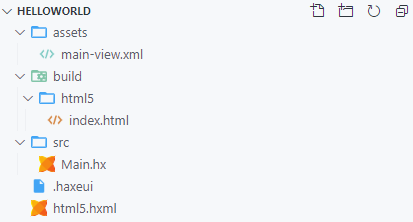
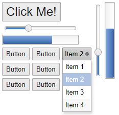
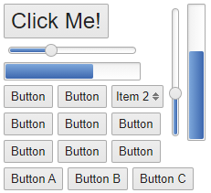
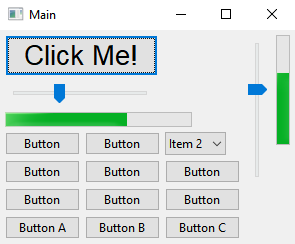

Hello World
================================

Assuming you have now installed HaxeUI and at least one backend a "Hello World" application is a good place to start. In this section we will be using the haxeui-html5 backend as its quick to compile and has zero other dependecies, however, once this application is complete its trivial to add another backend to the same application!

Project Creation
-------------------------
The first thing we want to do is to use the HaxeUI command line tools to create a simple project for us. Create an empty directory somewhere, open a command prompt in that directory and use the following command:

```
haxelib run haxeui-core create html5
```

This command will create a few files and folders inside your root directory:



* **src/Main.hx** - this is the main entry point for the HaxeUI application, in this example it uses the optional cross framework HaxeUIApp which means its is trivial to run the same code on multiple backends
* **assets/main-view.xml** - HaxeUI allows you to optionally use a markup lanugage (like xml) to design your views, these can later be converted into code at compile time. This file will be used inside the main application entry point.
* **html5.hxml** - this is the build file for the haxeui-html5 version of this application, generally, when you later add more backends to this example only new build files will appear

Building and Running
-------------------------
Compiling and exeucting this application couldnt be simpler, in the same terminal window simply use:

```
haxe html5.hxml
```

In a second or two the haxe command will complete and you will have a `Main.js` along side the `index.html` in the `build/html5` folder. Simply open that file in any browser by double clicking on it and you will see a basic button:


And thats it! You now have a functioning HaxeUI application, that is ready to have more components and controls added to it!


Adding Components
-------------------------
There are two main ways to add components in HaxeUI: via markup like XML, or by using Haxe code. They can be used interchangeably and whether you choose one or the other is mostly a matter of taste, although generally using markup seperates your layout code from your application logic better.

#### Adding Components via XML

HaxeUI allows you add your components using a markup language like XML, this is generally a better option for applications that have big UIs as managing the view creation and layout via code can become unweidly and a mental burden for large applications. Its also generally better to seperate layout from logic and using XML can help greatly in this regard.

_Note: HaxeUI comes with XML support out of the box, but the parsing of that XML into something that can be used to create code is abstracted meaning that other markup languages (like JSON or YAML) can be plugged in, even custom markup would be possible!_

Building on the previous example, all we need to do is open `assets/main-view.xml` in a text editor and add more compents to it, for example:

```xml
<vbox style="padding: 5px;">
    <hbox>
        <vbox>
            <button text="Click Me!" style="font-size: 24px;" />
            <slider pos="33" />
            <progress pos="66" />
            <hbox>
                <button text="Button" />
                <button text="Button" />
                <dropdown selectedIndex="1">
                    <data>
                        <item text="Item 1" />
                        <item text="Item 2" />
                        <item text="Item 3" />
                        <item text="Item 4" />
                    </data>
                </dropdown>
            </hbox>
            <grid columns="3">
                <button text="Button" />
                <button text="Button" />
                <button text="Button" />
                <button text="Button" />
                <button text="Button" />
                <button text="Button" />
            </grid>
        </vbox>

        <slider direction="vertical" pos="33" />
        <progress direction="vertical" pos="66" />
    </hbox>
</vbox>
```



Obviously this is a very simple example and in no way shows the full component set of HaxeUI, but its a good introduction into how to add components via XML

#### Adding Components via Code

Components can also be added using regular haxe code, although its perfectly acceptable to add components in this way, it can become hard to move components around once an application gets a little larger. To build on the previous example we can open `src/Main.hx` and add the following pretty much anywhere in the `app.ready` callback:

```haxe
app.ready(function() {
    var mainView:Component = ComponentMacros.buildComponent("assets/main-view.xml");
    app.addComponent(mainView);

    var hbox = new HBox();
    var button = new Button();
    button.text = "Button A";
    hbox.addComponent(button);
    var button = new Button();
    button.text = "Button B";
    hbox.addComponent(button);
    var button = new Button();
    button.text = "Button C";
    hbox.addComponent(button);
    mainView.addComponent(hbox);

    app.start();
});
```



As you can see, we have now added another set of horizontal buttons on the bottom of the main view via code. You may also be able to tell that although perfectly functional, this method of adding components can get very out of hand for applications with 100s of components.

_Note: HaxeUI can further help you split up your UI into smaller, more managable peices by the use of custom components / views, more information can be found out about them in "Next Steps"_

Adding Another Backend
-------------------------
The final part to this "Hello World" application is to show how powerful the backend system is inside HaxeUI by adding another backend to this example application. In this case we will be using haxeui-hxwidgets, this is a native backend and has quite alot of dependencies which must be installed and worked.

If you arent interested in native UIs or the cross framework capabilities of HaxeUI you can stop now and head over to next steps.

In order to add another backend to the existing project simply go back to the command prompt used earlier and use:

```
haxelib run haxeui-core create hxwidgets
```

This will create files for the haxeui-hxwidgets backend but wont overwrite any existing files, meaning the changes made so far will be unaffected. You should now have a `hxwidgets.hxml` file in the root directory. To compile simply use:

```
haxe hxwidgets.hxml
```

This may take a little time (since it will be using C++) but once complete you should have an executable in the `build/hxwidgets` folder named `Main`

Since this HaxeUI application is 100% native it may look different on different systems, for example this what it looks like on Windows 10:




