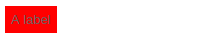
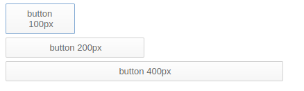
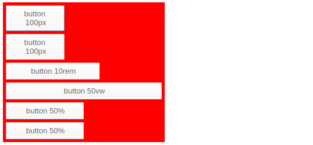
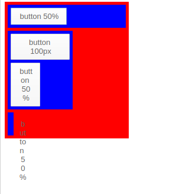
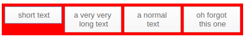
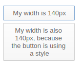
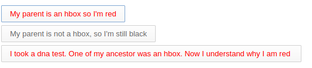
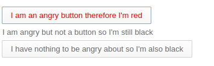
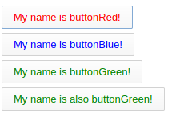
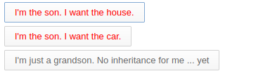

Styling
=======

Sizing
-------------------

### Autosizing

By default, components size to their children, that's what we call *autosizing* For example

```xml
<vbox style="padding: 5px;" backgroundColor="red">
    <label text="A label" />
</vbox>
```



You'll notice that the vbox has taken the size of the label. (The label has the size of the text)

### Using specific size

You can use of course specific size

```xml
<vbox style="padding: 5px;">
    <button text="button 100px" width="100"/>
    <button text="button 200px" width="200"/>
    <button text="button 400px" width="400"/>
</vbox>
```



It doesn't need to be pixels

```xml
<vbox style="padding: 5px;" backgroundColor="red">
    <button text="button 100px" width="100"/>
    <button text="button 100px" style="width:100px"/>
    <button text="button 10rem" style="width:10rem"/>
    <button text="button 20vw"  style="width:20vw"/>
    <button text="button 50%"   style="width:50%"/>
    <button text="button 50%"   percentWidth="50"/>
</vbox>
```



### Percent size of parent

```xml
<vbox style="padding: 5px;" backgroundColor="red">
    <vbox style="padding: 5px;" width="200" backgroundColor="blue">
        <button text="button 50%" percentWidth="50"/>
    </vbox>
    <vbox style="padding: 5px;" backgroundColor="blue">
        <button text="button 100px" width="100"/>
        <button text="button 50%" percentWidth="50"/>
    </vbox>
    <vbox style="padding: 5px;" backgroundColor="blue">
        <button text="button 50%" percentWidth="50"/>
    </vbox>
</vbox>
```



Notice how the third box seems buggy, it's because the button is 50% of the vbox which doesn't have size (and therefore is *autosized*). Be careful, you'll likely cause this in your own layouts at least once by giving children a percent size of parent whose size cant be calculated. 

The button "button 50%" in the second vbox works, because the *autosized* vbox took its size from the "button 100px".

### Having children components of the same size

Usually if you want a box with 3 buttons of the same size you would do:

```xml
<hbox width="400">
    <button text="short text" width="33%"/>
    <button text="a very very long text" width="33%"/>
    <button text="a normal text" width="33%"/>
</hbox>
```

But what if you add a fourth one, you would have to change all the sizes

```xml
<hbox width="400">
    <button text="short text" width="25%"/>
    <button text="a very very long text" width="25%"/>
    <button text="a normal text" width="25%"/>
    <button text="oh forgot this one" width="25%"/>
</hbox>
```

This is quite bug prone, and if you dynamically add buttons it makes the code quite complicated.



The best way to achieve this is to mark all components as 100% - HaxeUI will then caculate the appropriate size for each one.

```xml
<hbox width="400">
    <button text="short text" width="100%"/>
    <button text="a very very long text" width="100%"/>
    <button text="a normal text" width="100%"/>
    <button text="oh forgot this one" width="100%"/>
</hbox>
```

**Note**: you can also have fixed sized components there too, HaxeUI will calculate the sizes based on the *remaining* available space. 

Creating styles with CSS
------------------------

First, let's learn the basics about CSS

### Apply the css to a component or stylename

#### . selector

```css
.button {
    width: 120px;
}
```

As you can see the **selector starts with dot**

<b>.component</b> signifies the component name or a component with a specific style name

In context:

```xml
<vbox style="padding: 5px;">
    <style>
        .button {
            width: 140px;
        }
    </style>
    <button text="My width is 140px"/>
    <button text="My width is also 140px, because the button using a style"/>
</vbox>
```



#### Spaced selectors

```css
.hbox .button {
    color: red;
}
```

The two dotted selectors are separated by a space (**.component .child**). This means that first any component with `hbox` style will be matched, and then any other component that is a child of that match with a `button` style. 

```xml
<vbox style="padding: 5px;">
    <style>
        .hbox .button {
	    color: red;
        }
    </style>
    <hbox>
        <button text="My parent is an hbox so I'm red" />
    </hbox>
    <button text="My parent is not a hbox, so I'm still black"/>
    <hbox>
        <vbox>
            <vbox>
                <button text="I took a dna test. One of my ancestor was an hbox. Now I understand why I am red " />
            </vbox>
        </vbox>
    </hbox>
</vbox>
```

**Note**: there is no limit to the number of items you can match in a rule tree - and the style names dont have to be directly related. 



#### Non Spaced selectors

```css
.button.angry {
    color: red;
}
```

Two dotted selectors without separation (**.name1.name2**) means the component must have both style names.

```xml
<vbox style="padding: 5px;">
    <style>
        .button.angry {
            color: red;
        }
    </style>
    <button text="I am an angry button therefore I'm red" styleName="angry"/>
    <label text="I am angry but not a button so I'm still black" styleName="angry"/>
    <button text="I have nothing to be angry about so I'm also black"/>
</vbox>
```



#### Hashtags

```css
#myButton {

}
```

You can use the hashtag when referencing a component with the given Id

```xml
<vbox style="padding: 5px;">
    <style>
        #buttonRed {
            color: red;
        }

        #buttonBlue {
	    color: blue;
        }

        #buttonGreen {
	    color: green;
        }
    </style>
    <button id="buttonRed" text="My name is buttonRed!" />
    <button id="buttonBlue" text="My name is buttonBlue!" />
    <button id="buttonGreen" text="My name is buttonGreen!" />
    <button id="buttonGreen" text="My name is also buttonGreen!" />
</vbox>
```



#### > operator

```css
.vbox > .button {
    color: red;
}

```

">" is used only for direct children (children, not grandchildren).
It means that it will apply to the direct child button of a vbox.

```xml
<vbox style="padding: 5px;">
    <style>
        #man > .button {
            color: red;
        }
    </style>
    <vbox id="man">
        <button text="I'm the son. I want the house." />
        <button text="I'm the son. I want the car." />
        <vbox>
            <button  text="I'm just a grandson. No inheritance for me ... yet" />
        </vbox>
    </vbox>
</vbox>
```

#### Mixing it all together

Its worth mentioning that all of the above rules can be used together in order to create very tight (or very expansive) rules to select, and therefore style, groups of components. The following is perfectly valid (although somewhat contrived):

```css
#myComponent .vbox > .hbox .foo > .bar .myStyle#someId .bar.foo .something:hover {
}
```

You can see some explanations here https://community.haxeui.org/t/css-operator-addition/266

