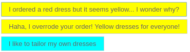
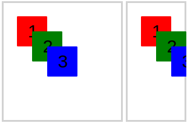
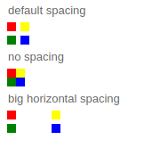

Styling
=======

Sizing
-------------------

### Autosizing

By default, components size to their children, that's what we call *autosizing* For example

```xml
<vbox style="padding: 5px;" backgroundColor="red">
    <label text="A label" />
</vbox>
```


You'll notice that the vbox has taken the size of the label. (The label has the size of the text)

### Using specific size

You can use of course specific size

```xml
<vbox style="padding: 5px;">
    <button text="button 100px" width="100"/>
    <button text="button 200px" width="200"/>
    <button text="button 400px" width="400"/>
</vbox>
```


It doesn't need to be pixels

```xml
<vbox style="padding: 5px;" backgroundColor="red">
    <button text="button 100px" width="100"/>
    <button text="button 100px" style="width:100px"/>
    <button text="button 10rem" style="width:10rem"/>
    <button text="button 20vw"  style="width:20vw"/>
    <button text="button 50%"   style="width:50%"/>
    <button text="button 50%"   percentWidth="50"/>
</vbox>
```


### Percent size of parent

```xml
<vbox style="padding: 5px;" backgroundColor="red">
    <vbox style="padding: 5px;" width="200" backgroundColor="blue">
        <button text="button 50%" percentWidth="50"/>
    </vbox>
    <vbox style="padding: 5px;" backgroundColor="blue">
        <button text="button 100px" width="100"/>
        <button text="button 50%" percentWidth="50"/>
    </vbox>
    <vbox style="padding: 5px;" backgroundColor="blue">
        <button text="button 50%" percentWidth="50"/>
    </vbox>
</vbox>
```


Notice how the third box seems buggy, it's because the button is 50% of the vbox which doesn't have size (and therefore is *autosized*). Be careful, you'll likely cause this in your own layouts at least once by giving children a percent size of parent whose size cant be calculated. 

The button "button 50%" in the second vbox works, because the *autosized* vbox took its size from the "button 100px".

### Having children components of the same size

Usually if you want a box with 3 buttons of the same size you would do:

```xml
<hbox width="400">
    <button text="short text" width="33%"/>
    <button text="a very very long text" width="33%"/>
    <button text="a normal text" width="33%"/>
</hbox>
```

But what if you add a fourth one, you would have to change all the sizes

```xml
<hbox width="400">
    <button text="short text" width="25%"/>
    <button text="a very very long text" width="25%"/>
    <button text="a normal text" width="25%"/>
    <button text="oh forgot this one" width="25%"/>
</hbox>
```

This is quite bug prone, and if you dynamically add buttons it makes the code quite complicated.


The best way to achieve this is to mark all components as 100% - HaxeUI will then caculate the appropriate size for each one.

```xml
<hbox width="400">
    <button text="short text" width="100%"/>
    <button text="a very very long text" width="100%"/>
    <button text="a normal text" width="100%"/>
    <button text="oh forgot this one" width="100%"/>
</hbox>
```

**Note**: you can also have fixed sized components there too, HaxeUI will calculate the sizes based on the *remaining* available space. 

Creating styles with CSS
------------------------

First, let's learn the basics about CSS

### Apply the css to a component or stylename

#### . selector

```css
.button {
    width: 120px;
}
```

As you can see the **selector starts with dot**

<b>.component</b> signifies the component name or a component with a specific style name

In context:

```xml
<vbox style="padding: 5px;">
    <style>
        .button {
            width: 140px;
        }
    </style>
    <button text="My width is 140px"/>
    <button text="My width is also 140px, because the button using a style"/>
</vbox>
```


#### Spaced selectors

```css
.hbox .button {
    color: red;
}
```

The two dotted selectors are separated by a space (**.component .child**). This means that first any component with `hbox` style will be matched, and then any other component that is a child of that match with a `button` style. 

```xml
<vbox style="padding: 5px;">
    <style>
        .hbox .button {
	    color: red;
        }
    </style>
    <hbox>
        <button text="My parent is an hbox so I'm red" />
    </hbox>
    <button text="My parent is not a hbox, so I'm still black"/>
    <hbox>
        <vbox>
            <vbox>
                <button text="I took a dna test. One of my ancestor was an hbox. Now I understand why I am red " />
            </vbox>
        </vbox>
    </hbox>
</vbox>
```

**Note**: there is no limit to the number of items you can match in a rule tree - and the style names dont have to be directly related. 


#### Non Spaced selectors

```css
.button.angry {
    color: red;
}
```

Two dotted selectors without separation (**.name1.name2**) means the component must have both style names.

```xml
<vbox style="padding: 5px;">
    <style>
        .button.angry {
            color: red;
        }
    </style>
    <button text="I am an angry button therefore I'm red" styleName="angry"/>
    <label text="I am angry but not a button so I'm still black" styleName="angry"/>
    <button text="I have nothing to be angry about so I'm also black"/>
</vbox>
```


#### Hashtags

```css
#myButton {

}
```

You can use the hashtag when referencing a component with the given Id

```xml
<vbox style="padding: 5px;">
    <style>
        #buttonRed {
            color: red;
        }

        #buttonBlue {
	    color: blue;
        }

        #buttonGreen {
	    color: green;
        }
    </style>
    <button id="buttonRed" text="My name is buttonRed!" />
    <button id="buttonBlue" text="My name is buttonBlue!" />
    <button id="buttonGreen" text="My name is buttonGreen!" />
    <button id="buttonGreen" text="My name is also buttonGreen!" />
</vbox>
```


#### > operator

```css
.vbox > .button {
    color: red;
}

```

">" is used only for direct children (children, not grandchildren).
It means that it will apply to the direct child button of a vbox.

```xml
<vbox style="padding: 5px;">
    <style>
        #man > .button {
            color: red;
        }
    </style>
    <vbox id="man">
        <button text="I'm the son. I want the house." />
        <button text="I'm the son. I want the car." />
        <vbox>
            <button  text="I'm just a grandson. No inheritance for me ... yet" />
        </vbox>
    </vbox>
</vbox>
```


You can see some explanations here https://community.haxeui.org/t/css-operator-addition/266

#### ":" pseudo-classes

":" is used to apply the style only if some external factors happen.

For example "hover" happens when the mouse is moved over the component.

```css
.button:hover {
    color:red;
}
```

#### "*" to match every element

```css
* {
    font-name: 'assets/fonts/main.ttf';
}
```

#### "," to use multiple rules

You can also use apply styles to multiple rules by using a comma

```css

/* instead of doing this
.label {
    font-size: 13px;
}
.textfield{
    font-size: 13px;
}
.textarea {
    font-size: 13px;
}

*/
/* you can do this */
.label, .textfield, .textarea {
    font-size: 13px;
}
```

#### Mixing it all together

Its worth mentioning that all of the above rules can be used together in order to create very tight (or very expansive) rules to select, and therefore style, groups of components. The following is perfectly valid (although somewhat contrived):

```css
#myComponent .vbox > .hbox .foo > .bar .myStyle#someId .bar.foo .something:hover {
}
```

### Using CSS inside a XML Layout

There are multiple ways to use CSS inside a XML Layout

#### Using the **style** tag

This is a way used in most examples in this guide. It enables quick prototyping, and makes it easy to use in the builder.

```xml
<vbox width="150">
	<style>
		.myStyle{
			color: #FF0000;
			fontSize: 20;
		}
	</style>
	<button text="Button" width="100%" styleName="myStyle" />
</vbox>
```

Important! The style tag will apply not only inside the vbox but everywhere, it has a global scope by default.

You can still have a local scope using <style scope="local">

**Style scope example**

```xml
<vbox style="padding: 5px;">
<style>
.dress {
    background-color:red;
}
</style>
<button text="I ordered a red dress but it seems yellow... I wonder why?" styleName="dress"/>
<vbox>
<style>
.dress {
    background-color:yellow;
}
</style>
<button  text="Haha, I overrode your order! Yellow dresses for everyone!"  styleName="dress"/>
</vbox>
<vbox>
<style scope="local">
.dress {
    background-color:aqua;
}
</style>
<button text="I like to tailor my own dresses" styleName="dress"/>
</vbox>
</vbox>
```



#### Using the style attribute

This is a way used in most examples in this guide. It enables quick prototyping, and makes it easy to use in the builder. It is okay for simple styles. It will also have the highest priority.

```xml
<button text="Click Me!" onclick="this.text='Thanks!'" style="font-size: 24px;" />
```

### Using CSS in a separate file

You need to configure the path to the .css in the module.xml

```xml
<themes>
    <default>
        <style resource="style/custom.css" />
    </default>
</themes>
```

The advantages are that it easier to make themes. That you can use syntax highlighting etc in your ide.

### Applying a CSS stylesheet via code

```haxe
myComponent.styleSheet = new StyleSheet();
myComponent.styleSheet.parse("...")
```

It enables to parse some style sheets at runtime.

Layouts
-------

A layout is what enables to control position and dimension of children components.

Core layouts for boxes:

* default
* absolute
* vertical
* horizontal
* grid

But some components do also have a layout when on a composite backend, because they are composite components, they are made of other components : for example steppers have also a "classic" layout.

#### How to set layouts

##### By xml

```xml
<box layout="absolute">
</box>
```

##### By using styles or CSS

```css
#my_box {
    layout:absolute;
}
```

##### By code

#### Absolute Layout



You can check it on the [builder](https://haxeui.org/explorer/#layouts/absolute_layouts)


```xml
<box layout="absolute">
</box>
```

An **Absolute** is a special component, it is a box  with an absolute layout. So you can also do :

```xml
<absolute>
</absolute>
```

The position of the child component depends on :

* **top**
* **left**

TIP : if you want to set a child to the "bottom" or to the "right". You can use a default layout instead and use this [trick](#emulating-an-absolute-bottom-or-right)

#### Default

You can check it on the [builder](https://haxeui.org/explorer/#layouts/box_layouts)

The position of the child component depends on :

* **padding**
* **vertical-align**
* **horizontal-align**
* **margin**

##### Emulating an absolute bottom or right

```xml
<button text="I can emulate 'bottom' and 'right' using alignment and margin."  width="120" horizontalAlign="right"  verticalAlign="bottom" style="margin-right:30;margin-bottom:30"/>
```

#### Horizontal


You can check it on the [builder](https://haxeui.org/explorer/#layouts/horizonal_layouts)

A **HBox** is a special component, it is a box  with a horizontal layout. So you can also do :

```xml
<hbox>
</hbox>
```

The position of the child component depends on :

* **padding**
* **vertical-align**
* **index of child**
* **horizontal spacing**
* **margin**

#### Vertical

You can check it on the [builder](https://haxeui.org/explorer/#layouts/vertical_layouts)

A **VBox** is a special component, it is a box with a vertical layout. So you can also do :

```xml
<vbox>
</vbox>
```

The position of the child component depends on :

* **padding**
* **horizontal-align**
* **index of child**
* **vertical spacing**
* **margin**

#### Grid


You can check it on the [builder](https://haxeui.org/explorer/#layouts/grid_layouts)

A **Grid** is a special component, it is a box with a vertical grid layout. So you can also do :

```xml
<grid>
</grid>
```

The position of the child component depends on :

* **padding**
* **horizontal-align**
* **vertical-align**
* **index of child**
* **number of columns**
* **spacing**
* **margin**

Attributes description
----------------------

### Layout attributes

#### Spacing

Spacing is the spacing between a container's children.
It is used by vbox, hbox, grid.



spacing

```css
.no-spacing {
    spacing:0; /* both horizontal spacing and vertical spacing will be set to O;
}
```

horizontal-spacing

```css
.spacing {
    horizontal-spacing:20;
    vertical-spacing:40;
    /* you can also do  spacing: %horizontal %vertical
    spacing:20 40;
    */
}
```

### Styling attributes
