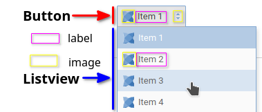
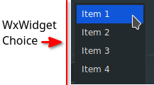
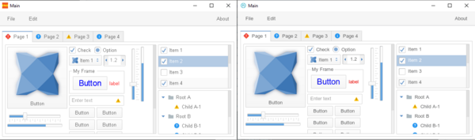

Native
================================


| Composite                                                    | Native                                                       |
| ------------------------------------------------------------ | ------------------------------------------------------------ |
| Built entirely out of HaxeUI components<br /> | Creation delegated to backend<br /> |
| Themes are applicable                                        | Themes most likely selective at best                         |
| Consistent yet custom look & feel<br /> | Look & feel matches host operating system<br /> |
| Every visible aspect configurable via CSS                    | Hard to create totally custom UIs                            |
| Logic layout handed via core                                 | Reports size back into core(if autosized)                    |


Hybrid user interfaces

- Mix and match composite and native components
- Get best of both worlds
- "Fill in gaps" in native toolkits

There are no hybrid user interface for now. HTML5 was an hybrid interface, but it is now a pure composite one.


## How does "native" work


Native means that instead of using the normal haxeui-core class it will use one specific to the platform

So for dropdowns, in haxe-ui hxWidgets instead of using `haxe.ui.components.DropDown` it will use `hx.widgets.Choice` . It will also replace behaviours events, with the native ones.

```xml
<native>
    <component id="haxe.ui.components.DropDown" class="hx.widgets.Choice" allowChildren="false" creator="none">
        <behaviour id="text" class="haxe.ui.backend.hxwidgets.behaviours.ChoiceSelectedLabel" />
        <behaviour id="dataSource" class="haxe.ui.backend.hxwidgets.behaviours.ChoiceDataSource" />
        <behaviour id="selectedIndex" class="haxe.ui.backend.hxwidgets.behaviours.ChoiceSelectedIndex" />
        <behaviour id="selectedItem" class="haxe.ui.backend.hxwidgets.behaviours.DataComponentSelectedItem" />
        <behaviour id="tooltip" class="haxe.ui.backend.hxwidgets.behaviours.ToolTipBehaviour" />
        <size class="haxe.ui.backend.hxwidgets.size.BestSize" includePadding="false" />
        <handler class="haxe.ui.backend.hxwidgets.handlers.ChoiceHandler" />
        <event id="change" native="EventType.CHOICE" />
    </component>
</native>
```
